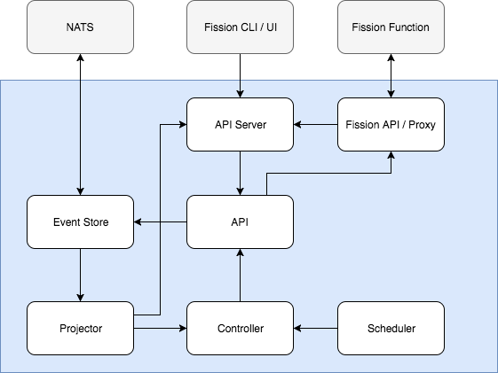

# System Architecture

This document describes the high-level architecture of the Fission Workflow system.

*System Architecture of Fission Workflow*

### API (Server)
The API is the central component of the Fission Workflow system.
It is responsible for exposing all actionable aspects of the system.
The API is the only component that should deal with appending events to the event stores.
Any other component wishing to add an event should do this using the API.
Note that it does not deal with fetching/getting/querying state, which is what the projectors are for.

The API Server is nothing more than a subset of the API exposed over HTTP/gRPC to other services.
This allows systems such as UIs and CLIs to access and manipulate the workflow and their invocations.

### Fission Proxy / API
In order to interact with the function execution layer, Fission Workflow contains a concise API to interface with Fission.
For the engine itself, a Fission Function Invocation API implements the Function Invocation API interface, allowing the engine to interact with Fission in a consistent way.
This API currently consists out of the ability to lookup functions from the Fission controller, and the ability to invoke Fission functions. 

On the other hand, the Fission Proxy exposes the workflow engine as just another Fission function towards Fission.
It implements a small server that conforms with the regular Fission environment API.
This allows Fission to view and treat workflows just as any other Fission function, allowing re-use workflows and off-loading concerns to Fission such as scalability, versioning, etc. 

### Event Store
Actions taken by the API results in most cases in events that update the state of a workflow, workflow invocation or function invocation.
Given the focus on fault-tolerance, reliability and the inherent event-driven nature of workflow invocations, the [event sourcing](https://martinfowler.com/eaaDev/EventSourcing.html) paradigm is a good fit for the system.
In this context, the event store is an append-only database or data store that ensures persistent storage of the events.

Currently, the message system [NATS Streaming](http://nats.io/documentation/streaming/nats-streaming-intro/) is used as the underlying event store, as it is fast, offers PubSub functionality, allows for persistence and replays.
The interface for the event store is minimal, consisting of APPEND, GET, LIST, WATCH, allowing for easy integration with other data stores if needed.

### Projector
As the event store holds events and not the current state, current state needs to be constructed from the events.
A projector is essentially a left fold, or reduce, operation of events onto a state object `(currentState, event) -> newState`.
Each event type has an associated left fold operation, allowing the projector to construct the current state, or the state at any point in the past, 
One advantage of this is that the workflow engine can go fail at any point, come back up, and reconstruct its state from the events.

As reconstructing state from events every time the state is expensive, a **cache** is used by the projector to store the current state.
Optionally, the projector can register to receive new events from the event store, using WATCH, which it uses to update the models in the cache.   

### Controller
The controller is the 'engine' in the workflow engine.
It keeps track of current invocations, asks the scheduler to decide on how to advance, and executes the instructions of the scheduler for these invocations.

There are two ways that the controller keeps track of invocations.
First, the controller consists of a control loop.
This loop consists of the controller going through the current, active invocation, and deciding whether action is needed.
Second, it subscribes to so-called *notifications* of the projector, which are send when a model has been updated.
These notifications are essentially an 'fast path' for invocations to be evaluated by the controller the instant they are updated.
However, these notifications can always fail to be published or received, for any reason.
The invocations to which these failed notifications belong will be picked up by the control loop.  

### Scheduler
Where the controller is the heart of the workflow system, the scheduler is the brains.
When the controller invokes the scheduler for a specific invocation, the scheduler evaluates the current state of invocation.
Based on this data and potentially others, such as historical data, it creates a scheduling plan.
This scheduling plan contains actions that need to be taken by the controller, such as (re)invoking a function or aborting the workflow invocation all together.
The scheduler is completely stateless, so the controller can at any time request a (re)evaluation if needed. 

More details on the scheduler will follow...

### Dependencies
This section contains an summary of the dependencies of the Fission Workflow system. 
Currently, the dependencies consist of Fission, as the Function Execution layer, and NATS, as the event store implementation.

#### Fission FaaS Platform
The workflow engine uses Fission as the underlying Function Execution Layer.
Using the Fission Proxy Fission is able to treat the workflows as just another Fission function, and treat the workflow engine as just another environment. 

#### NATS Messaging System 
Other than Fission, currently NATS is the only other dependency of Fission Workflows.
It is used as the persistent data store for storing the events related to the workflow invocations.
Although no specific requirement forces the system to use NATS, it was chosen for its performance, persistence and PubSub functionality.
